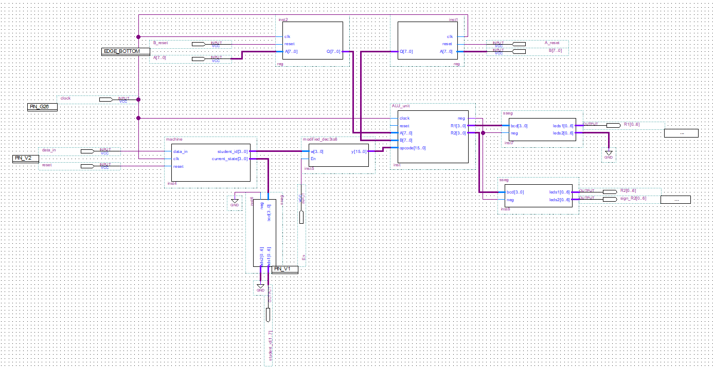
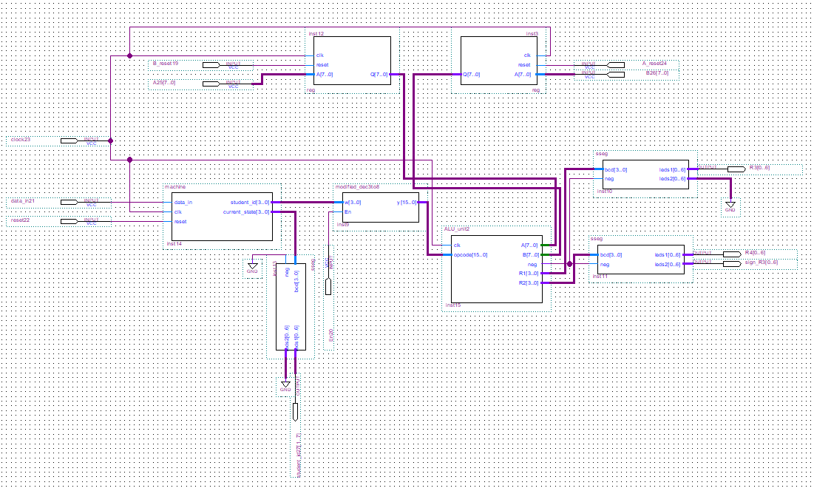
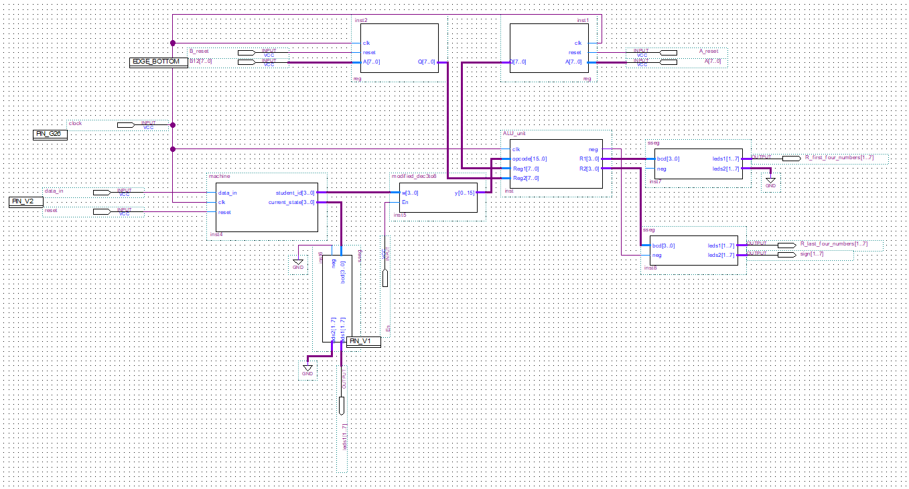

# 8-bit CPU Design in VHDL

Three progressively complex CPU implementations developed for COE328 (Digital Systems) at Toronto Metropolitan University. Each design was deployed to and tested on an Altera Cyclone II EP2C35 FPGA with seven-segment display output.

## Overview

**CPU v1** - Basic 8-bit ALU with arithmetic and logic operations  
**CPU v2** - Enhanced ALU with bit manipulation capabilities  
**CPU v3** - Complete CPU integrating FSM, registers, and conditional logic

## Processor Variants

### CPU v1: Basic ALU (`ALU_unit.vhd`)
The first implementation provides fundamental arithmetic and logic operations.

**Features:**
- 8-bit data path (inputs A and B)
- 16-bit opcode input
- Synchronous operation with clock and active-low reset

**Operations:**
| Opcode | Operation | Description |
|--------|-----------|-------------|
| `0x0001` | A + B | Addition |
| `0x0002` | A - B | Subtraction (with neg flag) |
| `0x0004` | NOT A | Bitwise inversion |
| `0x0008` | A NAND B | Logical NAND |
| `0x0010` | A NOR B | Logical NOR |
| `0x0020` | A AND B | Logical AND |
| `0x0040` | A XOR B | Logical XOR |
| `0x0080` | A OR B | Logical OR |

**Performance:**
- Single-cycle execution for all operations
- Operations: 8-bit addition/subtraction

### CPU v2: Advanced ALU (`ALU_unit2.vhd`)
Enhanced design with bit manipulation and data transformation capabilities.

**Features:**
- Advanced bit-level operations
- Register-to-register data processing
- Same interface as v1 for compatibility

**Operations:**
| Opcode | Operation | Description |
|--------|-----------|-------------|
| `0x0001` | Bit Reverse | Reverses bit order of A (A[0]→Result[7]) |
| `0x0002` | Shift Left 4 | Shifts A left by 4, fills with 1s |
| `0x0004` | Invert Upper | Inverts upper 4 bits of B |
| `0x0008` | Min(A,B) | Returns smaller of A or B |
| `0x0010` | (A + B) + 4 | Sum with constant offset |
| `0x0020` | A + 3 | Increment by 3 |
| `0x0040` | Even Bit Replace | Replaces even bits of A with even bits of B |
| `0x0080` | A XNOR B | Logical XNOR (equivalence) |

**Performance:**
- Single-cycle execution
- Operations: Addition with constant (A + B + 4)

### CPU v3: FSM-Integrated CPU (`ALU_unit3.vhd`)
Complete CPU design integrating ALU with Finite State Machine for sequential operation.

**Features:**
- FSM-driven student ID cycling
- Register comparison logic
- Option flag output for conditional operations
- Returns to basic arithmetic/logic operations from v1

**New Capabilities:**
- Compares register values (Reg1) against student ID from FSM
- Sets `option` flag when upper or lower 4 bits match student ID
- Enables state-dependent computation
- Supports multi-stage data processing pipelines

## Block Diagrams

### CPU v1


### CPU v2


### CPU v3



## Components

### Finite State Machine (`fsm.vhd`)
- 8-state machine (S0-S7)
- Cycles through student ID digits (2-6-0-8)
- Provides 4-bit output representing current digit
- Synchronous state transitions with active-high reset

### Register/Latch (`register.vhd`)
- 8-bit storage element
- Synchronous loading on rising clock edge
- Synchronous reset to zero
- Holds data between computation cycles

### 4-to-16 Decoder (`modified_dec3to8.vhd`)
- Converts 4-bit input (last 4 digits of student ID: 2608)
- Generates encoded 16-bit opcode
- Enable signal for controlled activation
- Maps student number to operation selection

### Seven-Segment Display Driver (`sseg.vhd`)
- Converts 4-bit BCD to seven-segment patterns
- Dual display support (two 7-segment displays)
- Negative flag visualization on second display
- Active-low outputs

### Arithmetic Support Unit (`ASU.vhd`)
- 4-bit arithmetic unit
- Addition and subtraction modes (controlled by Cin)
- Carry out and overflow detection
- Supports multi-bit operations through cascading

## Hardware Specifications

**Target Device:** Altera Cyclone II EP2C35F672C6
- **Family:** Cyclone II
- **Max Operating Frequency:** 260 Hz
- **Embedded Memory:** 483 kbit

## Build Instructions

### Prerequisites
- **Quartus II 13.0**
- **ModelSim-Altera** for simulation (included with Quartus)
- **Altera Cyclone II EP2C35 FPGA board** for hardware deployment

### FPGA Deployment Steps

1. **Clone the repository:**
   ```bash
   git clone https://github.com/yourusername/simple-cpu-vhdl.git
   cd simple-cpu-vhdl
   ```

2. **Open Quartus II:**
   - Launch Quartus II 13.0
   - Open the project file (`.qpf`) in the root directory

3. **Select CPU variant:**
   - Set the desired ALU unit as the top-level entity:
     - `ALU_unit` for CPU v1
     - `ALU_unit2` for CPU v2
     - `ALU_unit3` for CPU v3

4. **Compile the design:**
   - Processing → Start Compilation
   - Or press `Ctrl+L`
   - Wait for compilation to complete (typically 2-5 minutes)

5. **Program the FPGA:**
   - Connect the Altera Cyclone II board via USB Blaster
   - Tools → Programmer
   - Add the `.sof` file from `output_files/`
   - Click "Start" to program

## Simulation

### Running Simulations

1. **Open ModelSim:**
   - From Quartus: Tools → Run Simulation Tool → RTL Simulation

2. **Load testbench:**
   - Testbenches are located in `simulation/` directory

3. **Run simulation:**
   ```
   vsim work.alu_unit_tb
   add wave *
   run 1000 ns
   ```

4. **View waveforms:**
   - Pre-generated waveforms available in `waveforms/` directory
   - Open `.vwf` files in Quartus for visual inspection

### Verification
Each CPU ALU has been verified with:
- Functional simulation of all opcodes with waveform timing analysis
- Hardware testing on physical FPGA board
- Seven-segment display using various test vectors

## Design Documentation

### Block Diagrams
Detailed block diagrams showing component interconnections are available in `block_diagrams/`. They show:
- Data flow between the components
- Control signal routing
- Register placement
- Global clocking setup

### Detailed Report Breakdown
A brief report (`COE328_Section12_Kevin_Karunaratna.pdf`) is included in the `labfiles/` directory, containing:
- Component descriptions
- Truth tables
- Waveform analysis
- Simulation results
- Hardware testing procedures
- Design methodology

## Course Information

**Course:** COE328 - Digital Systems  
**Institution:** Toronto Metropolitan University  
**Instructor:** Dr. Sedaghat Reza  
**Semester:** Fall 2024  

## Acknowledgments

- Toronto Metropolitan University Department of Electrical, Computer, and Biomedical Engineering
- Dr. Sedaghat Reza for course instruction
- TA Menglu Li for lab support
- Altera/Intel for FPGA development tools
